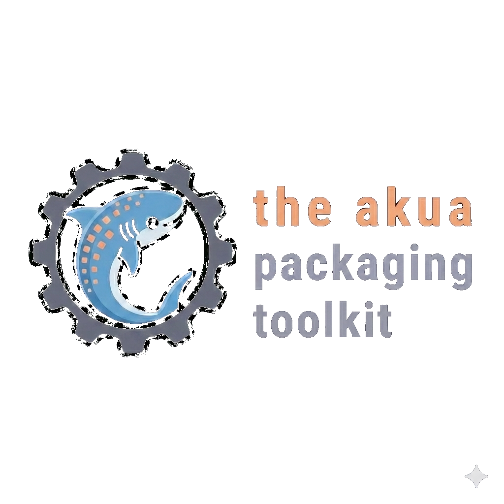

<div align="center">
  <!-- Large Hero Image -->
  
  
  <h1>akua</h1>

  <!-- Airy Technical Description -->
  <p>
    <samp>
      Cloud-native packaging in one binary &bull; Typed packages<br>
      Sandboxed renders &bull; Signed by default
    </samp>
  </p>

  <br>
  
  <!-- Badges -->
  <p>
    <a href="https://github.com/cnap-tech/akua/releases/latest"></a>
    <a href="https://www.npmjs.com/package/@akua-dev/sdk"></a>
    <a href="./LICENSE"></a>
  </p>
  
  <br>

  <!-- High-Energy Quote -->
  <p>
    <font size="4">
      <strong><em>
        "Innovative teams eventually notice how much more sense cloud-native makes once they replace the bureaucratic mass of drifting YAML with high-energy, deterministic contracts."
      </em></strong>
    </font>
  </p>
</div>


  <br>

<p align="center">
  
</p>

---

`akua` is a single Rust binary that does for cloud-native what `bun` and `deno` do for JavaScript: package manager, runtime, formatter, linter, test runner, REPL, dev loop, and signed-OCI publisher — one CLI, one contract, no `$PATH` dependency. Packages are authored in [KCL](https://kcl-lang.io) (typed configuration language); existing Helm charts and Kustomize bases are callable inside KCL programs (`helm.template(...)`, `kustomize.build(...)`); every render runs in a wasmtime WASI sandbox.

```sh
# install (macOS / Linux)
curl -fsSL https://akua.dev/install | sh

# render anywhere
akua render --inputs inputs.yaml --out ./deploy
```

## Quick start

A real Package: typed inputs, an OCI-fetched Helm chart with **typed values**, and a KCL overlay across every rendered resource. No `helm` binary on the machine; no shell-out anywhere.

```toml
# akua.toml — deps are typed; resolver pins them in akua.lock with cosign verification
[package]
name    = "blog"
version = "0.1.0"
edition = "akua.dev/v1alpha1"

[dependencies]
nginx = { oci = "oci://registry-1.docker.io/bitnamicharts/nginx", version = "18.2.0" }
```

```kcl
# package.k
import akua.ctx
import charts.nginx as nginx

schema Input:
    name:     str = "blog"
    replicas: int = 2
    tenant:   str

    check:
        replicas >= 1, "replicas must be >= 1"

input: Input = ctx.input()

# Helm chart called as an alias-method. `nginx.Values` is a generated
# schema, not an untyped dict — typos surface as KCL compile errors.
_workload = nginx.template(nginx.TemplateOpts {
    values = nginx.Values {
        replicaCount     = input.replicas
        fullnameOverride = input.name
    }
    release = input.name
})

# Overlay every rendered resource with a tenant label.
resources = [r | {
    metadata.labels = { "app.cnap.tech/tenant" = input.tenant }
} for r in _workload]
```

```sh
akua render --inputs prod.yaml --out ./deploy   # sandboxed render → raw manifests
akua publish .                                  # cosign-signed OCI artifact + SLSA attestation
```

For cross-Package composition (install one Akua package on top of another, with overlays / filters / extras), see [`examples/11-install-as-package/`](examples/11-install-as-package/). Twelve worked examples — Helm, Kustomize, multi-engine, package composition, KCL ecosystem, install-as-Package — each commit `rendered/` goldens byte-checked in CI.

## Why akua

- **Sandboxed by default.** Every render runs in a wasmtime WASI sandbox with memory / CPU / wall-clock caps. No shell-out, no `$PATH` lookup, no ambient filesystem. Untrusted Packages are safe to render on shared hosts. Adversarial test suite proves each invariant. See [`docs/security-model.md`](docs/security-model.md).
- **Typed packages, not YAML templates.** KCL has real schemas, real types, real imports. Drift between the value the operator wrote and the value the chart consumed becomes a compile error, not a 3am incident.
- **Embedded engines.** Helm v4 + Kustomize compiled to `wasm32-wasip1` and hosted inside akua. `helm.template(...)` works without a `helm` binary anywhere on your machine. See [`docs/embedded-engines.md`](docs/embedded-engines.md).
- **Signed + attested.** `akua publish` emits cosign signatures and SLSA v1 attestations by default; consumers verify on pull. ECDSA P-256 keyed cosign today; keyless on the v0.3 roadmap.
- **Deterministic.** Same inputs + same lockfile + same akua version → byte-identical output. No `now()`, no `random()`, no env reads in the render pipeline.
- **Compose with the ecosystem.** kpm-published KCL packages (`oci://ghcr.io/kcl-lang/*`) drop straight into `[dependencies]` — `import k8s.api.apps.v1` resolves against the upstream schema bundle. See [`examples/10-kcl-ecosystem/`](examples/10-kcl-ecosystem/).
- **Agent-first.** Auto-detects Claude Code, Cursor, Codex, Gemini CLI, Goose, Amp, OpenCode, Cline, and 25+ other agents. Every verb emits `--json`, uses typed exit codes, and ships skill manifests under [`skills/`](skills/) conforming to the [Agent Skills Specification](https://agentskills.io). See [`docs/agent-usage.md`](docs/agent-usage.md).

## Install

```sh
# macOS / Linux
curl -fsSL https://akua.dev/install | sh

# Homebrew
brew install cnap-tech/tap/akua

# Windows
irm https://akua.dev/install.ps1 | iex

# From source
cargo install --git https://github.com/cnap-tech/akua akua-cli
```

```sh
# TypeScript SDK — in-process via napi, no `akua` binary on PATH
bun add @akua-dev/sdk

# Agent skills (universal — works across 25+ agents)
npx skills install github:cnap-tech/akua/skills
```

Prebuilt binaries: [Releases](https://github.com/cnap-tech/akua/releases). Container image: `ghcr.io/cnap-tech/akua`. Agent-specific setup: [`docs/agent-usage.md`](docs/agent-usage.md).

## Documentation

| | |
|---|---|
| **Authors** | [Package format](docs/package-format.md) · [Lockfile format](docs/lockfile-format.md) · [Examples](examples/) · [Skills](skills/) |
| **Operators** | [CLI reference](docs/cli.md) · [CLI contract](docs/cli-contract.md) · [SDK](docs/sdk.md) · [Agent usage](docs/agent-usage.md) |
| **Internals** | [Architecture](docs/architecture.md) · [Embedded engines](docs/embedded-engines.md) · [Security model](docs/security-model.md) · [Performance](docs/performance.md) |
| **Project** | [Roadmap](docs/roadmap.md) · [Use cases](docs/use-cases.md) · [Changelog](CHANGELOG.md) |

## Status

**Alpha.** Stable contracts: the 26-verb CLI surface, the universal flag/exit-code contract, the WASM-backed SDK methods, the sandbox invariant. Anything in [`docs/roadmap.md`](docs/roadmap.md) under Phase 5+ may change before v1.0. Safe for CI and agent workflows today; pin akua versions for production rollouts.

## Security

The render path is structurally hardened: no shell-out, no `$PATH`, every engine runs inside wasmtime with memory / epoch / filesystem-capability caps. Threat model and disclosure process: [`SECURITY.md`](SECURITY.md). Implementation detail and adversarial-test catalogue: [`docs/security-model.md`](docs/security-model.md).

## Contributing

Issues and small focused PRs are welcome — typos, doc clarity, test coverage, security findings. For larger changes, open an issue first so we can align on shape. See [`CONTRIBUTING.md`](CONTRIBUTING.md) and [`CODE_OF_CONDUCT.md`](CODE_OF_CONDUCT.md).

## License

[Apache-2.0](LICENSE).

<sub><em>Akua</em> — Hawaiian for *divine spirit*; echoes <em>aqua</em>, water. Cloud-native naming tradition: Docker loads the cargo, Helm steers the ship, Harbor stores what's shipped, Kubernetes (Greek <em>kubernḗtēs</em>, "helmsman") pilots the fleet. Akua is the current underneath.</sub>
